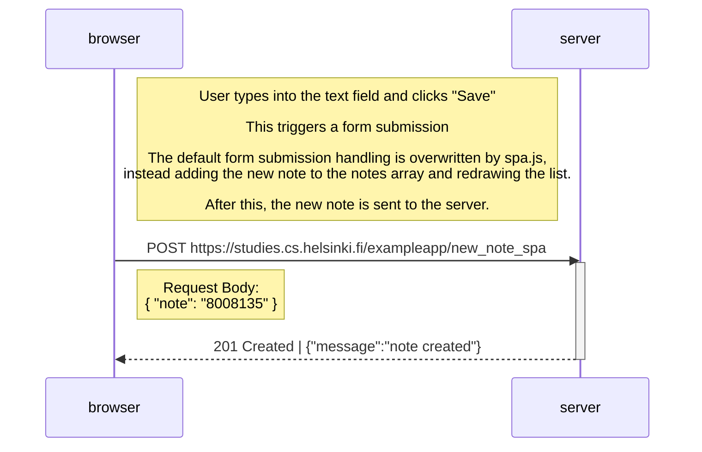

```mermaid
sequenceDiagram
    participant browser
    participant server

    Note right of browser: User types into the text field and clicks "Save"<br><br>This triggers a form submission<br><br>The default form submission handling is overwritten by spa.js,<br>instead adding the new note to the notes array and redrawing the list.<br><br>After this, the new note is sent to the server.

    browser->>server: POST https://studies.cs.helsinki.fi/exampleapp/new_note_spa
    activate server
    Note right of browser: Request Body:<br>{ "note": "8008135" }
    server-->>browser: 201 Created | {"message":"note created"}
    deactivate server
```
